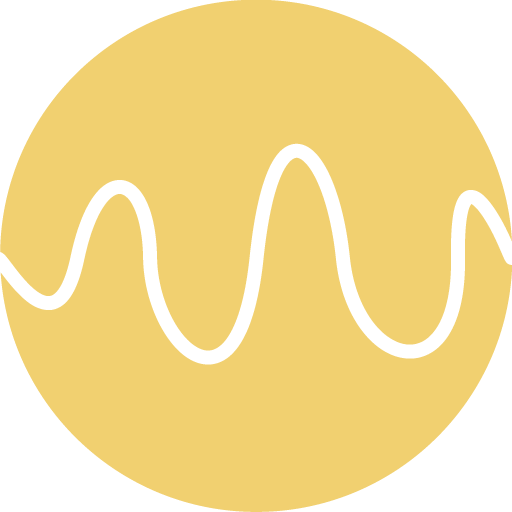

<h1>Photon</h1>

<hr/>


Meteor app to control <a href="https://store.particle.io/collections/photon" target="_blank">Photon</a>-connected lights.

### About

This project contains the source code for my personal Android application for controlling my lights. The lights are controlled using a <a href="https://store.particle.io/collections/photon" target="_blank">Photon</a> device and a relay. My lights are connected to the relay and this app triggers a function in the Photon to turn on/off the relay.

The app is built with Meteor which allows me to compile an APK for my Android phone.


## Setup

0. **Install Meteor**

    On Linux & Mac:

    ```sh
    > curl https://install.meteor.com/ | sh
    ```

    This will setup [Meteor](http://github.com/meteor/meteor) (including [Node](https://github.com/nodejs/node) and [Mongo](https://github.com/mongodb/mongo) if necessary).

    > _Note:_ Windows users must [download installer](https://www.meteor.com/install).

0. **Clone Repository**

    ```sh
    > git clone https://github.com/juangesino/photon.git
  > cd photon
    ```

0. **Install Dependencies**

    If you have npm installed:

    ```sh
    > npm install
    ```

    If you only have meteor:

    ```sh
    > meteor npm install
    ```

0. **Run**

    While in repository directory run:

    ```sh
    > meteor run
    ```

    Load browser and go to [http://localhost:3000/](http://localhost:3000/)


## Contributing

1. Fork it ( https://github.com/juangesino/photon/fork )
2. Create your feature branch (`git checkout -b my-new-feature`)
3. Commit your changes (`git commit -am 'Add some feature'`)
4. Push to the branch (`git push origin my-new-feature`)
5. Create a new Pull Request

## License

See [MIT-LICENSE](https://github.com/juangesino/photon/blob/master/LICENSE).
